# Capstone Project
Bits to Bites is a mobile Android Application developed using React Native, Spring, and H2 database.

It aims to help users reduce household waste and expenses by being able to search for recipes based on ingredients already available in their homes.

This application has been developed by Cora Dinatale, Nikola Vojinovic, Noah Huboux and Stefan Grujic.

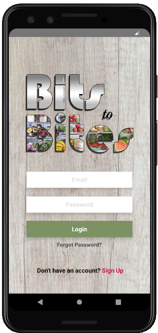

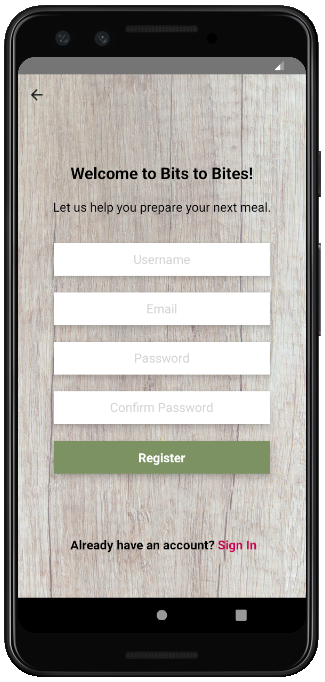

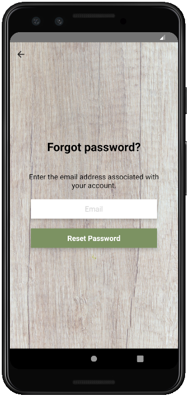

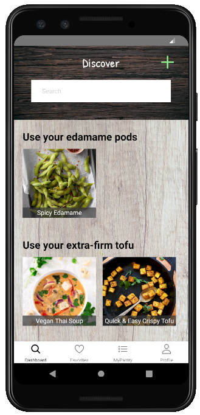

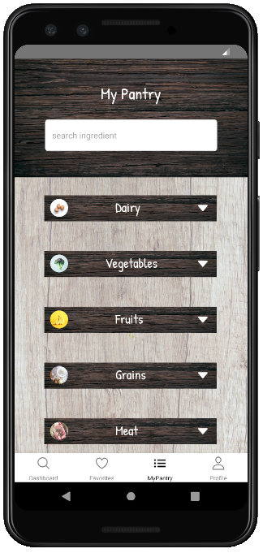

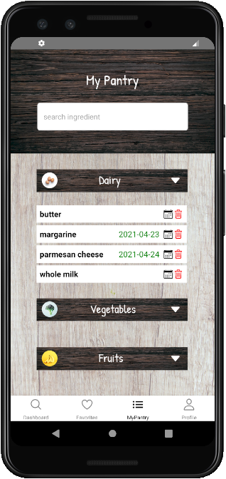

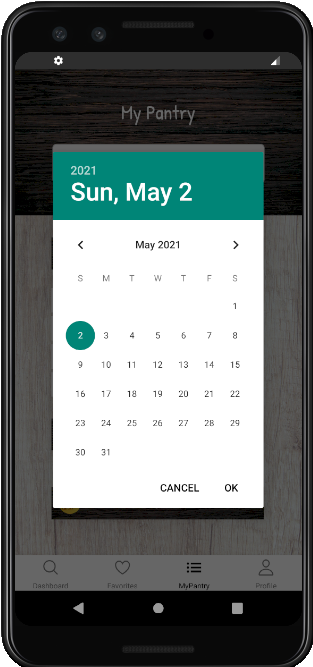

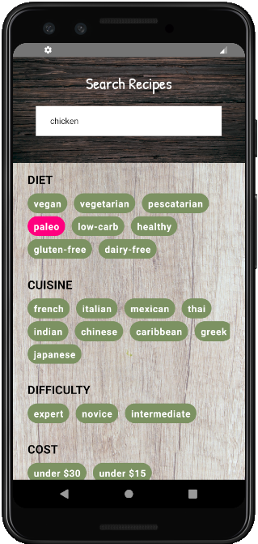

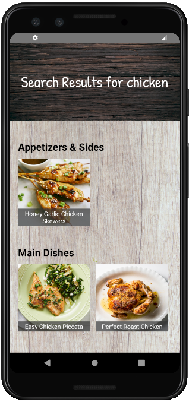

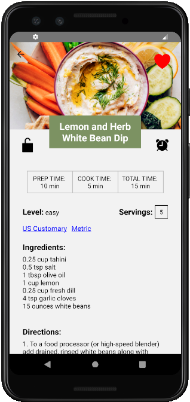

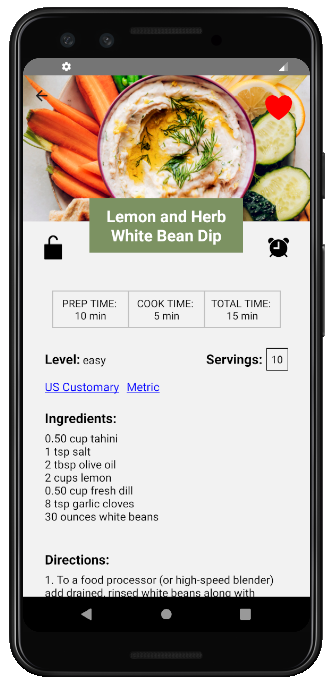

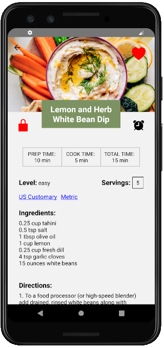

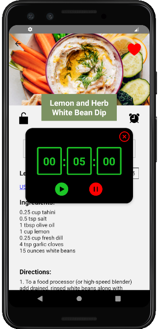

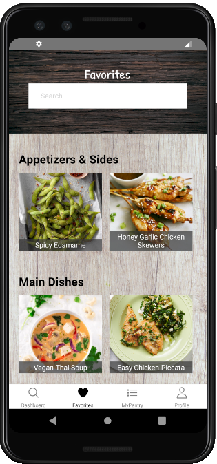

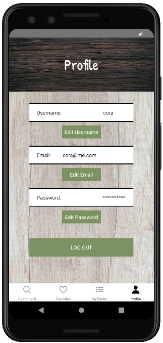

